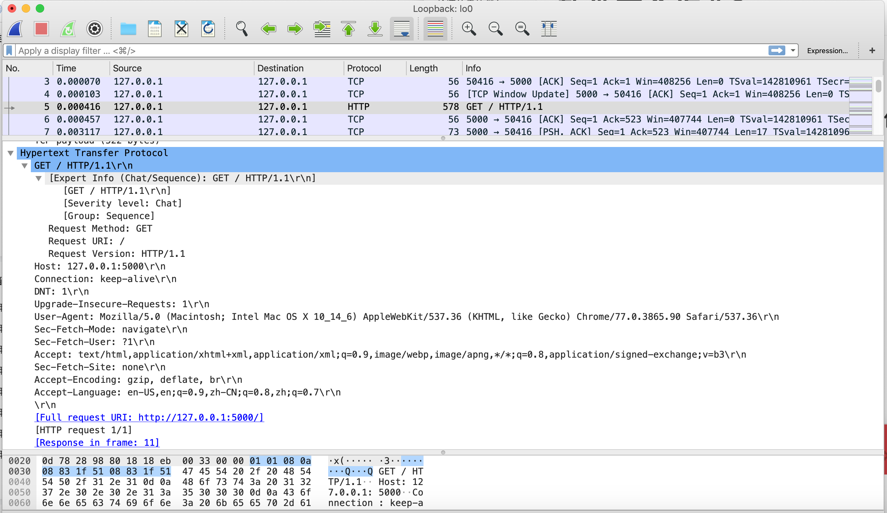
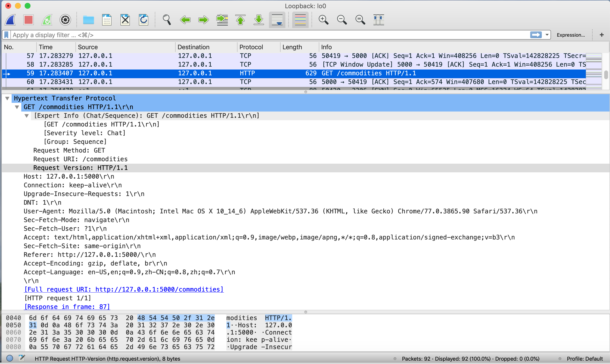
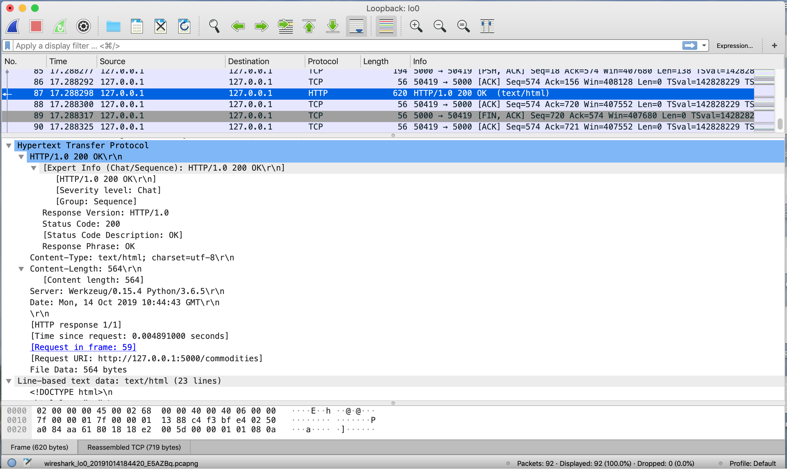
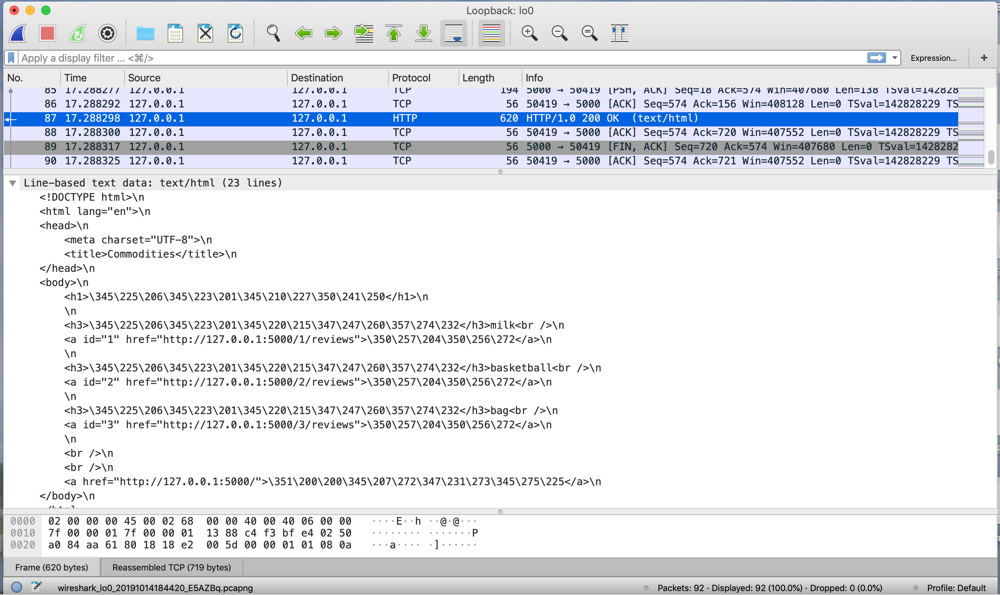
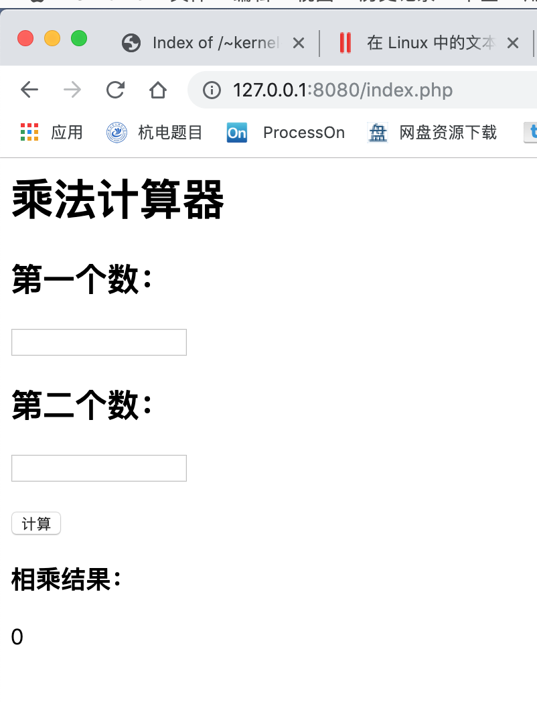
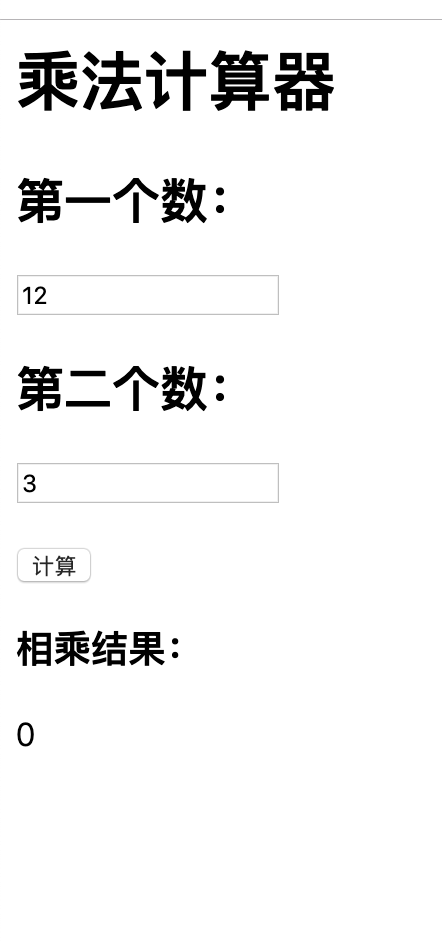
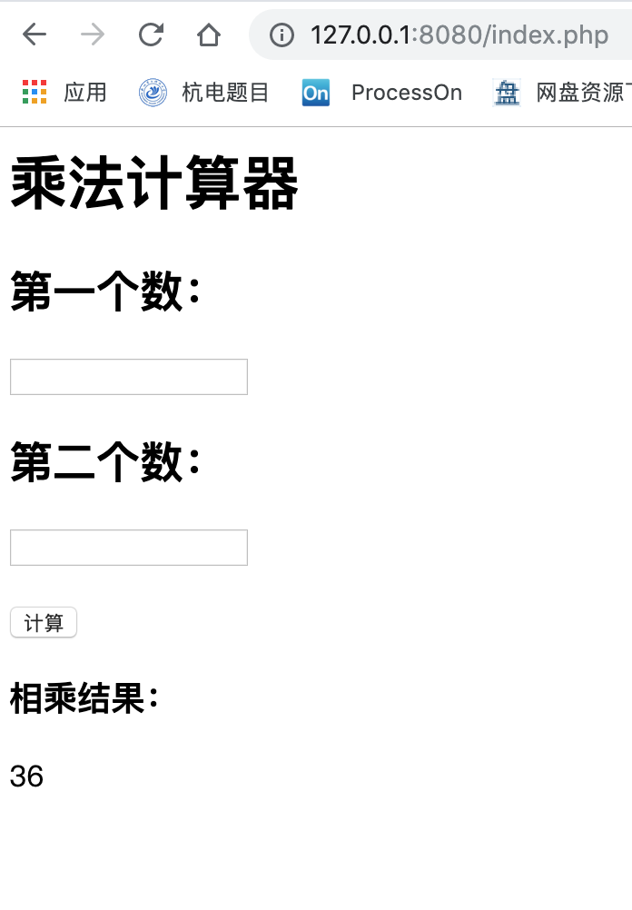

# 软件安全作业2

- 最基本的HTML站点的建立，静态网页
    - 抓包，http响应过程

### Mac系统Wireshark抓取本地网卡数据包：

选择监听Loopback: lo0 （环回地址）

响应过程：

1. 发出commodities页面的响应请求，请求方法为GET：

2. 响应该请求：

- 利用php + nginx/apache写简单的动态页面
    - e.g. 计算器
    
    
    
    
    
    
    
    - php调用数据库
    
- 学习Django

    - 快速构建web应用