# 二进制缓冲区溢出漏洞

## 缓冲区漏洞溢出定义

缓冲区是操作系统内存中一段连续的存储空间，当一段程序尝试把更多的数据放入一个缓冲区, 数据超出缓冲区的预留范围时, 或者说当一段程序尝试把数据放入的内存位置超出了缓冲区的边界时, 便触发了缓冲区溢出漏洞。

## 后果

缓冲区溢出攻击按照攻击后果的严重程度可分为导致程序崩溃(多数情况下会导致拒绝服务攻击)和获得系统控制权限两种。

## 操作系统内存组织方式

为了更准确地理解缓冲区溢出漏洞, 有必要了解操作系统中内存的组织方式.操作系统内存通常由4部分组成.

1. 代码段:存放可执行文件的操作指令；

2. 数据段:存放可执行文件中的全局变量和静态变量；

3. 堆:存放程序运行过程中动态分配的内存；

4. 栈:存放一些临时数据.在某个函数被调用时, 栈中依次压入ARG(函数调用时的实参)、RETADDR(下一条要执行的操作指令在内存中的地址)、EBP(上一个栈帧的EBP值)和LOCVAR(该函数中的局部变量).在一次函数调用完成后, 这些内容又从栈中移除。

## 配置

### 右键工程->属性

#### C/C++

->代码生成

- 启用C++异常 置空
- 基本运行时检查 置空
- 安全检查 禁用

->所有选项

- SDL检查设置为否

#### 调试

->命令行参数 设置为长数字字符串，中间不能有空格

## 相关说明

参数0是可执行程序的名字

ESP存栈顶指针

局部变量位于栈中

全局变量位于别的地方，一直占用内存空间

EBP(栈桢基址指针)用来定位函数的局部变量和参数

## 代码

~~~c
#define _CRT_SECURE_NO_WARNINGS

#include <stdlib.h>
#include <stdio.h>
#include <string.h>

int sub(char* x)
{
	
	char y[10];
	strcpy(y, x);
	return 0;
}

int main(int argc, char** argv)
{
	if (argc > 1)
		sub(argv[1]);
	printf("exit");
}
~~~

## 第一次下断点：

char y[10];处

开始调试后箭头指向strcpy处，右键转到反汇编

右键勾选显示代码字节，取消勾选显示符号名

调试->窗口->打开内存和寄存器窗口

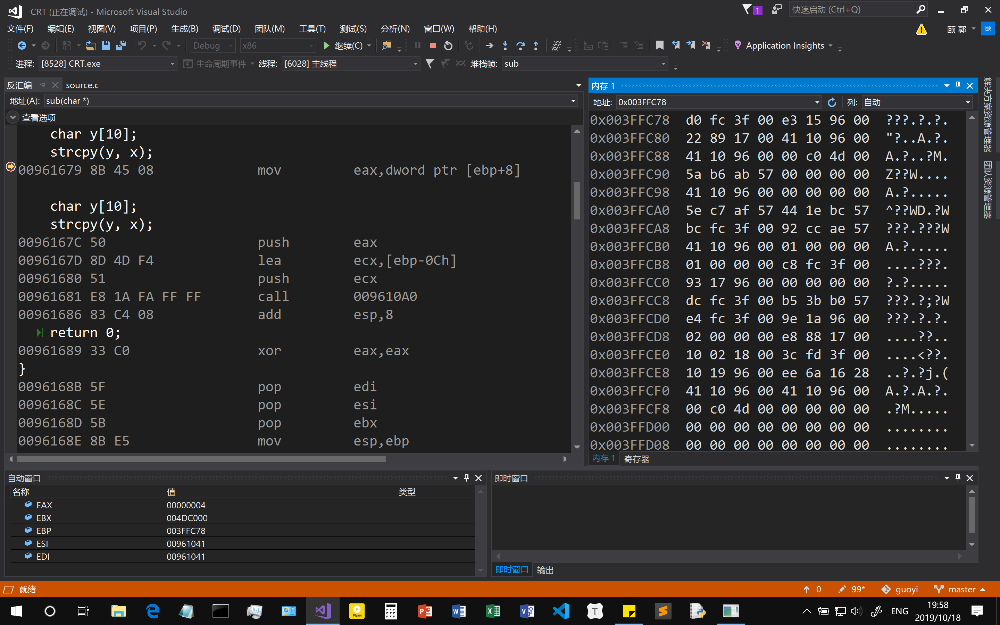

寄存器：

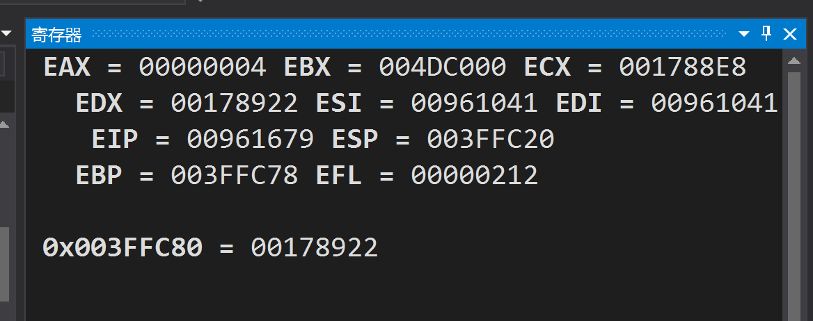

F10下一步

00961679 8B 45 08             mov         eax,dword ptr [ebp+8]

寄存器

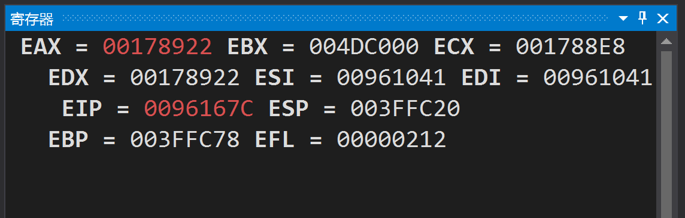

在内存中输入eax

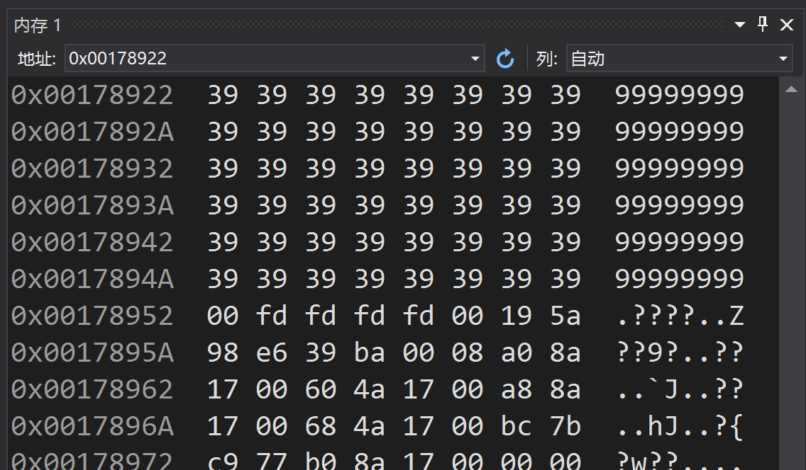

由此可以看出[ebp+8]中放的是x，这里体现了ebp定位函数参数的作用

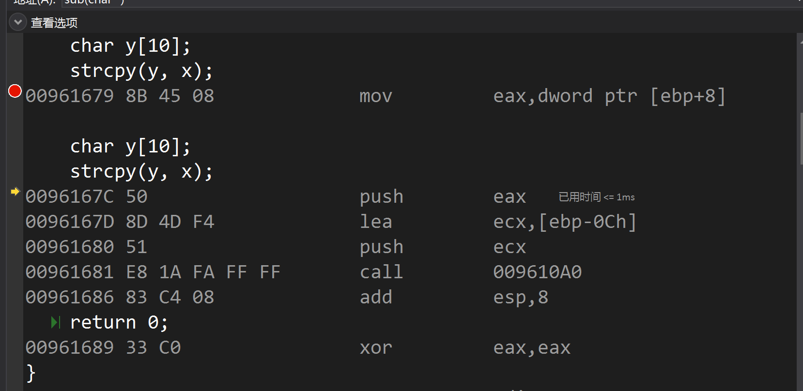

继续执行

eax进栈，栈顶指针esp发生变化

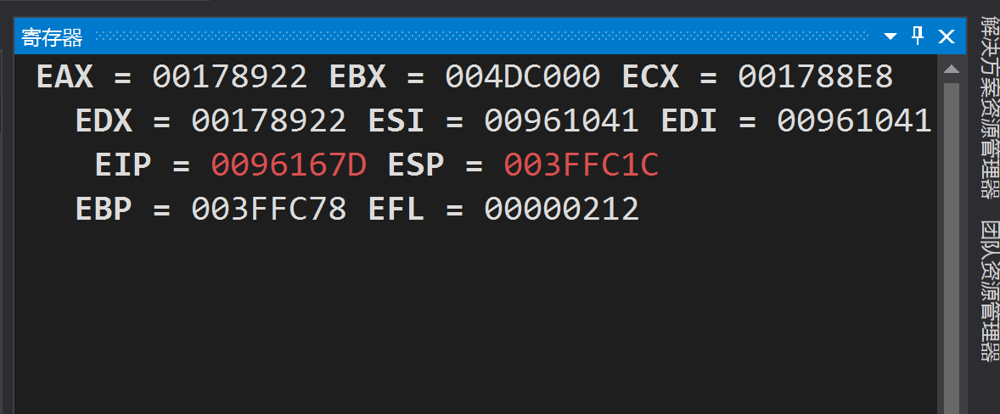

执行0096167D 8D 4D F4             lea         ecx,[ebp-0Ch]

这里的[ebp-0Ch]其实是y，体现了ebp定位函数局部变量的作用

ecx进栈

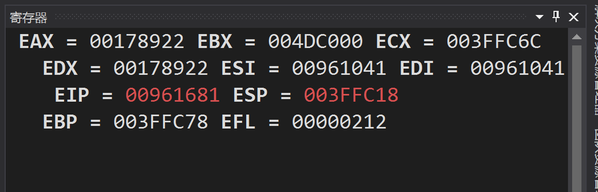

ecx:

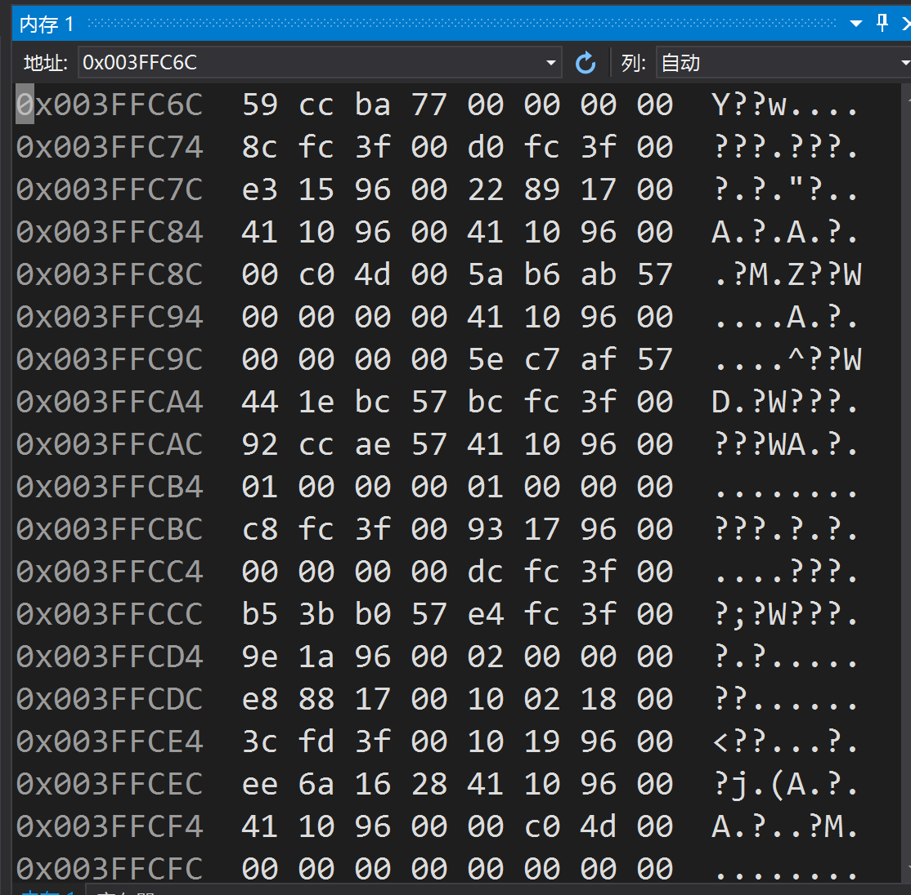

箭头指向00961681 E8 1A FA FF FF       call        009610A0  

转为单步调试（F11）

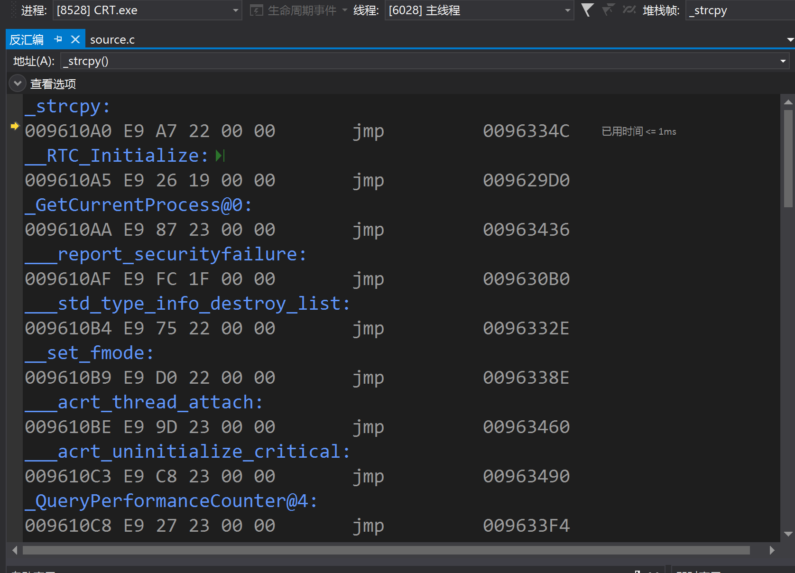

随着语句的执行，ecx中被写入eax的值

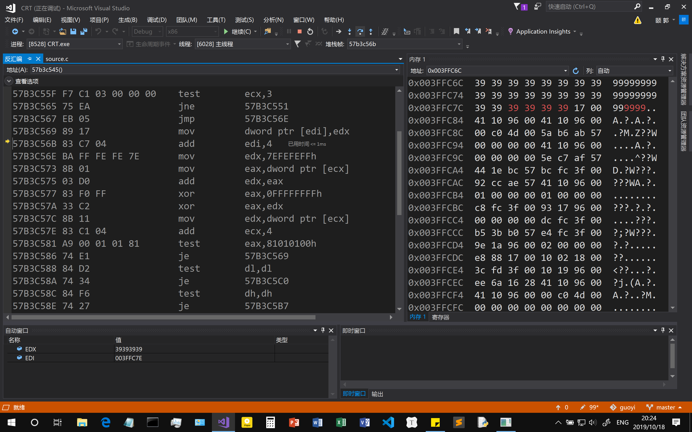

写完了，strcpy也执行完了

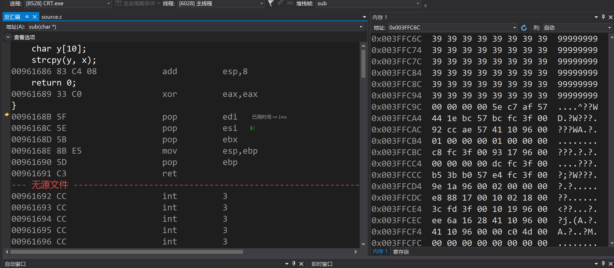

执行到ret的时候，出现访问冲突

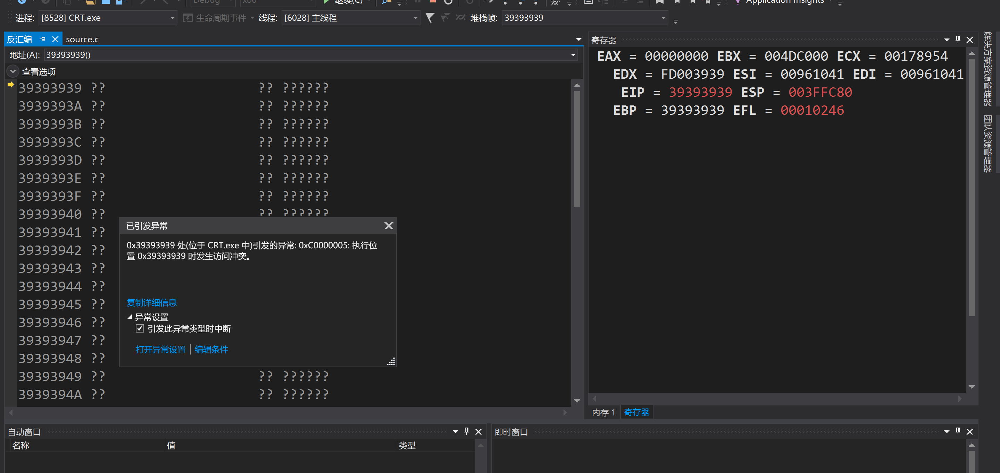

## 第二次下断点：

main函数中的sub调用位置

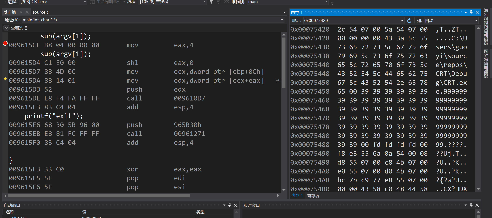

[ebp+0Ch]是argv[0]，体现了ebp栈桢基址指针的定位函数参数的作用

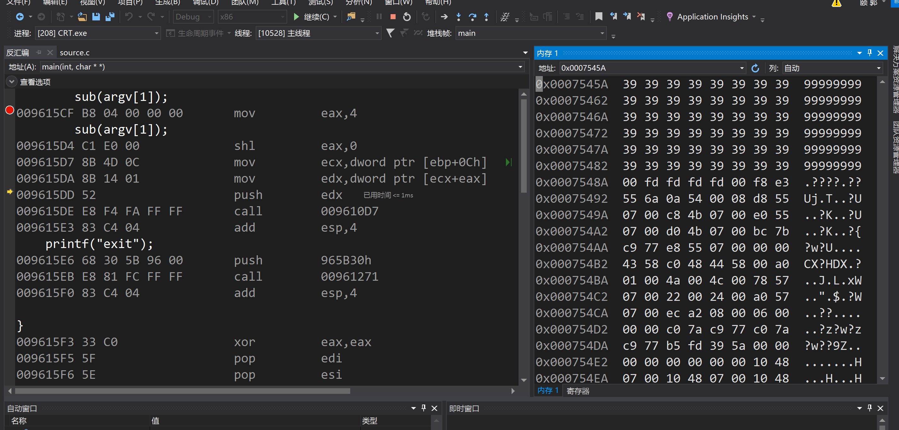

[ecx+eax]存放着argv[1]的值，被放入寄存器edx，edx进栈

到call指令，转为单步调试(F11)

进入sub函数

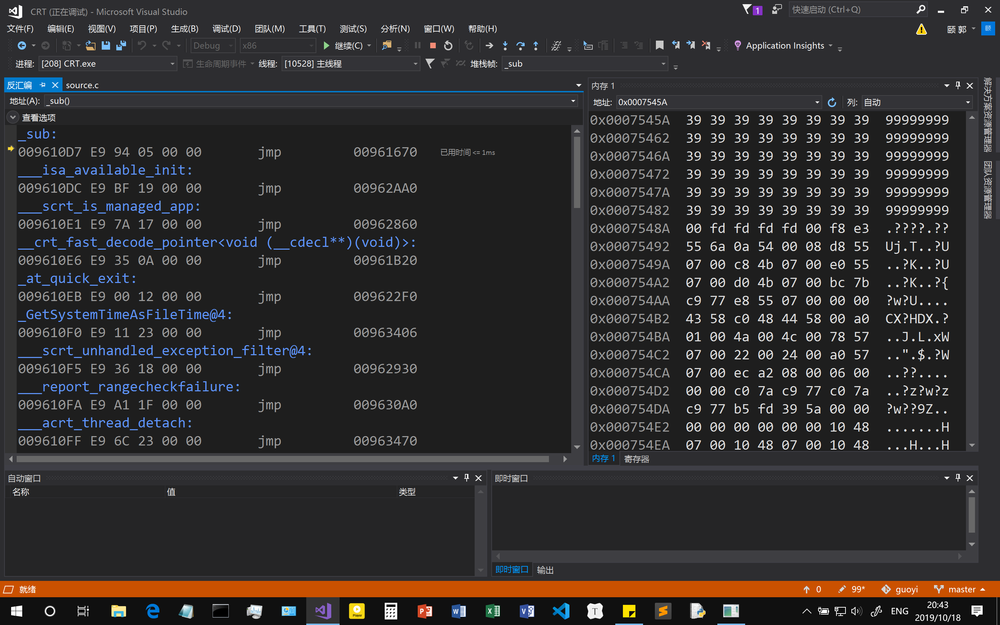

进入函数后先push ebp，然后mov ebp,esp，main函数和sub函数都这样

不同的是sub esp的值不一样

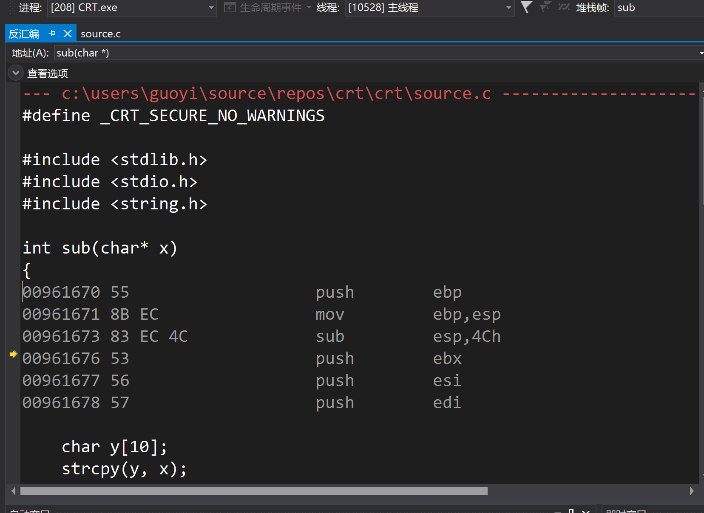

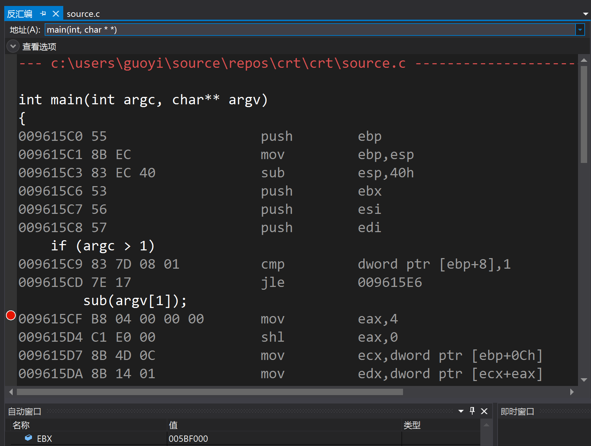

重新开始了一次，看到进入main函数执行完mov ebp,esp时EBP = 0133F944

进入sub函数执行完mov ebp,esp时EBP = 0133F8EC，说明sub的ebp初始化后比main的小，从栈中看在main上面，与下图保持一致：

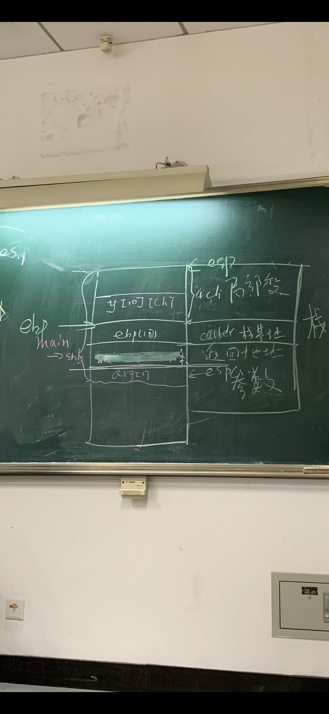

后面的过程刚好和第一次下断点的地方接住了。

# 总结

通过这次实验，我感觉自己更加（更加体现在除了理论的实践方面）理解了二进制缓冲区溢出漏洞的实现原理和巨大危害，对软件安全的重要性有了更加深刻的认识。