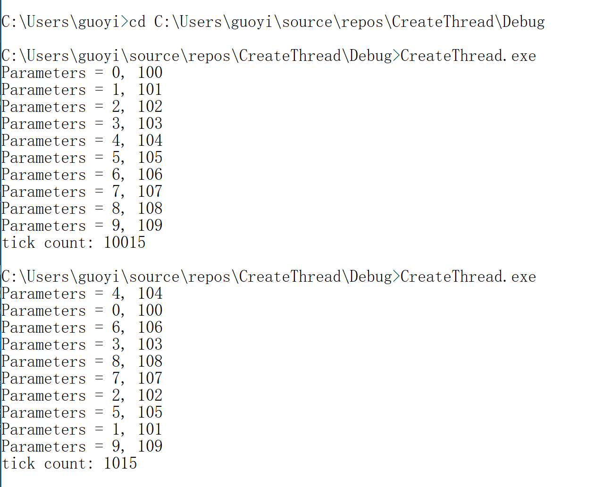
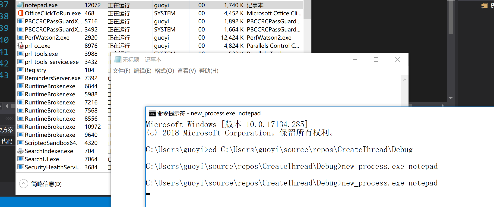
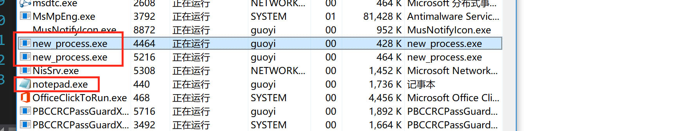
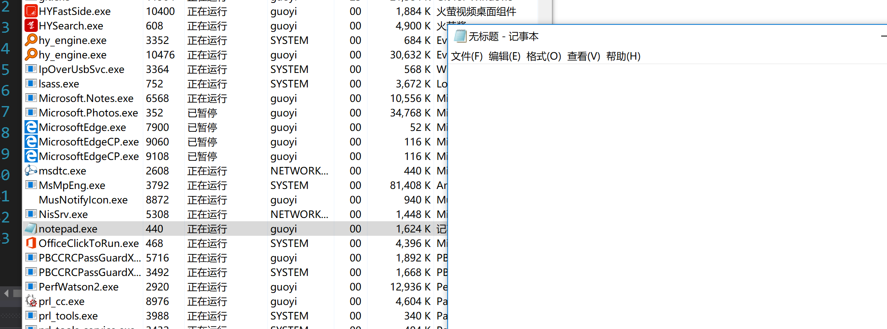

# 线程与进程

## [CreateThread](https://docs.microsoft.com/en-us/windows/win32/api/processthreadsapi/nf-processthreadsapi-createthread)

### 代码

```c++
// threads.cpp
// 单线程，没有宏定义多线程（#define MULTI_THREAD）
#include <windows.h>
#include <tchar.h>
#include <strsafe.h>

#define MAX_THREADS 10
#define BUF_SIZE 255

DWORD WINAPI MyThreadFunction(LPVOID lpParam);

// Sample custom data structure for threads to use.
// This is passed by void pointer so it can be any data type
// that can be passed using a single void pointer (LPVOID).
typedef struct MyData {
	int val1;
	int val2;
} MYDATA, *PMYDATA;

// 与main的区别是参数可以是Unix字符串
int _tmain()
{
	PMYDATA pDataArray[MAX_THREADS];
#ifdef MULTI_THREAD
	DWORD   dwThreadIdArray[MAX_THREADS];
	HANDLE  hThreadArray[MAX_THREADS];
#endif // MULTI_THREAD

	// Create MAX_THREADS worker threads.

	DWORD start = GetTickCount();

	for (int i = 0; i < MAX_THREADS; i++)
	{
		// Allocate memory for thread data.

		pDataArray[i] = (PMYDATA)malloc(sizeof(MYDATA));

		if (pDataArray[i] == NULL)
		{
			// If the array allocation fails, the system is out of memory
			// so there is no point in trying to print an error message.
			// Just terminate execution.
			ExitProcess(2);
		}

		// Generate unique data for each thread to work with.

		pDataArray[i]->val1 = i;
		pDataArray[i]->val2 = i + 100;

		// Create the thread to begin execution on its own.

#ifdef MULTI_THREAD

		hThreadArray[i] = CreateThread(
			NULL,                   // default security attributes
			0,                      // use default stack size  
			MyThreadFunction,       // thread function name
			pDataArray[i],          // argument to thread function 
			0,                      // use default creation flags 
			&dwThreadIdArray[i]);   // returns the thread identifier 


									// Check the return value for success.
									// If CreateThread fails, terminate execution. 
									// This will automatically clean up threads and memory. 

		if (hThreadArray[i] == NULL)
		{
			printf("CreateThread Error(%d)\n", GetLastError());
			ExitProcess(10);
		}
#else
		MyThreadFunction(pDataArray[i]);
#endif // MULTI_THREAD
	} // End of main thread creation loop.

	  // Wait until all threads have terminated.
#ifdef MULTI_THREAD
	  //TRUE：all, FALSE: single
	  //INFINITE: wait forever
	WaitForMultipleObjects(MAX_THREADS, hThreadArray, TRUE, INFINITE);
#endif // MULTI_THREAD

	DWORD end = GetTickCount();
	printf("tick count: %d\n", end - start);

	// Close all thread handles and free memory allocations.
#ifdef MULTITHREAD

	for (int i = 0; i < MAX_THREADS; i++)
	{
		CloseHandle(hThreadArray[i]);
		if (pDataArray[i] != NULL)
		{
			free(pDataArray[i]);
			pDataArray[i] = NULL;    // Ensure address is not reused.
		}
	}
#endif // MULTITHREAD
	return 0;
}


DWORD WINAPI MyThreadFunction(LPVOID lpParam)
{
	PMYDATA pDataArray;
	pDataArray = (PMYDATA)lpParam;
	Sleep(1000);
	// Print the parameter values using thread-safe functions.
	printf("Parameters = %d, %d\n", pDataArray->val1, pDataArray->val2);
	return 0;
}

// 多线程: 有宏定义多线程（#define MULTI_THREAD）
#include <windows.h>
#include <tchar.h>
#include <strsafe.h>

#define MAX_THREADS 10
#define BUF_SIZE 255
#define MULTI_THREAD

DWORD WINAPI MyThreadFunction(LPVOID lpParam);

// Sample custom data structure for threads to use.
// This is passed by void pointer so it can be any data type
// that can be passed using a single void pointer (LPVOID).
typedef struct MyData {
	int val1;
	int val2;
} MYDATA, * PMYDATA;


int _tmain()
{
	PMYDATA pDataArray[MAX_THREADS];
#ifdef MULTI_THREAD
	DWORD   dwThreadIdArray[MAX_THREADS];
	HANDLE  hThreadArray[MAX_THREADS];
#endif

	// Create MAX_THREADS worker threads.

	DWORD start = GetTickCount();

	for (int i = 0; i < MAX_THREADS; i++)
	{
		// Allocate memory for thread data.

		pDataArray[i] = (PMYDATA)malloc(sizeof(MYDATA));

		if (pDataArray[i] == NULL)
		{
			// If the array allocation fails, the system is out of memory
			// so there is no point in trying to print an error message.
			// Just terminate execution.
			ExitProcess(2);
		}

		// Generate unique data for each thread to work with.

		pDataArray[i]->val1 = i;
		pDataArray[i]->val2 = i + 100;

		// Create the thread to begin execution on its own.
		
#ifdef MULTI_THREAD

		hThreadArray[i] = CreateThread(
			NULL,                   // default security attributes
			0,                      // use default stack size  
			MyThreadFunction,       // thread function name
			pDataArray[i],          // argument to thread function 
			0,                      // use default creation flags 
			&dwThreadIdArray[i]);   // returns the thread identifier 

		// Check the return value for success.
		// If CreateThread fails, terminate execution. 
		// This will automatically clean up threads and memory. 

		if (hThreadArray[i] == NULL)
		{
			printf("CreateThread Error(%d)", GetLastError());
			ExitProcess(10);
		}
#else
		MyThreadFunction(pDataArray[i]);
#endif
	} // End of main thread creation loop.

	// Wait until all threads have terminated.
#ifdef MULTI_THREAD
	WaitForMultipleObjects(MAX_THREADS, hThreadArray, TRUE, INFINITE);
#endif

	DWORD end = GetTickCount();
	printf("tick count: %d\n", end - start);

	// Close all thread handles and free memory allocations.
#ifdef MULTI_THREAD

	for (int i = 0; i < MAX_THREADS; i++)
	{
		CloseHandle(hThreadArray[i]);
		if (pDataArray[i] != NULL)
		{
			free(pDataArray[i]);
			pDataArray[i] = NULL;    // Ensure address is not reused.
		}
	}
#endif
	return 0;
}


DWORD WINAPI MyThreadFunction(LPVOID lpParam)
{
	PMYDATA pDataArray;
	pDataArray = (PMYDATA)lpParam;
	Sleep(1000);
	printf("Parameters = %d, %d\n", pDataArray->val1, pDataArray->val2);
	return 0;
}
```

### 单线程顺序执行

结果图中的第一次执行结果

分析：

* 单线程顺序执行的总时长约为1000的10倍
* 输出的参数是顺序的

### 多线程执行

结果图中第二次执行结果

分析：

* 多线程执行的总时长约为1000
* 输出的参数是无序的
* 经过多次实验观察到输出的参数val1小的排在前面的可能性大

### 结果图



## [CreateProcess](https://docs.microsoft.com/en-us/windows/win32/api/processthreadsapi/nf-processthreadsapi-createprocessa)

### 代码

```c++
// run.cpp
#include <windows.h>
#include <stdio.h>
#include <tchar.h>

void _tmain(int argc, TCHAR *argv[])
{
	STARTUPINFO si;
	PROCESS_INFORMATION pi;

	ZeroMemory(&si, sizeof(si));
	si.cb = sizeof(si);
	ZeroMemory(&pi, sizeof(pi));

	if (argc != 2)
	{
		printf("Usage: %s [cmdline]\n", argv[0]);
		return;
	}

	// Start the child process. 
	if (!CreateProcess(NULL,   // No module name (use command line)
		argv[1],        // Command line
		NULL,           // Process handle not inheritable
		NULL,           // Thread handle not inheritable
		FALSE,          // Set handle inheritance to FALSE
		0,              // No creation flags
		NULL,           // Use parent's environment block
		NULL,           // Use parent's starting directory 
		&si,            // Pointer to STARTUPINFO structure
		&pi)           // Pointer to PROCESS_INFORMATION structure
		)
	{
		printf("CreateProcess failed (%d).\n", GetLastError());
		return;
	}

	// Wait if child process exits.
	WaitForSingleObject(pi.hProcess, INFINITE);

	// Close process and thread handles. 
	CloseHandle(pi.hProcess);
	CloseHandle(pi.hThread);
}
```

### 执行

步骤：在文件资源管理器中打开或直接Ctrl+O->

到上一级目录的Debug目录下->

复制路径C:\Users\guoyi\source\repos\CreateThread\Debug->

cd C:\Users\guoyi\source\repos\CreateThread\Debug->

new_process.exe notepad



### 父进程与子进程

new_process.exe "new_process.exe notepad"

如图，多了三个进程



* 如果先结束上面的new_process.exe时，下面两个进程不受影响，重复操作，如果先结束下面的new_process.exe，上面的new_process.exe也会跟着结束。

* 重复操作，如果先结束两个new_process.exe进程，发现notepad.exe进程依然存在



* 重复操作，如果先结束进程notepad.exe进程，发现两个new_process.exe进程也随之结束了

​	分析

* 本例中，父进程是上面的new_process.exe，子进程是下面的new_process.exe，子进程的子进程是notepad.exe，子进程结束时，父进程也会结束，父进程结束时，子进程不受影响；

* 通过更多层的嵌套，如

    ~~~shell
    new_process.exe "new_process.exe \"new_process.exe notepad\""
    ~~~

验证上述看套规则依然成立，子进程结束，父进程跟着结束，父进程结束，子进程不受影响。