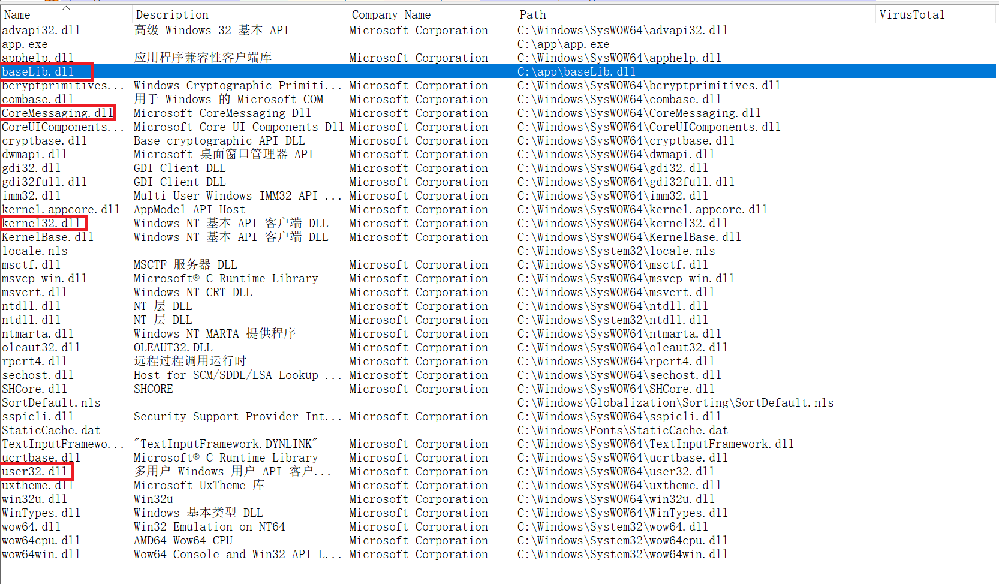
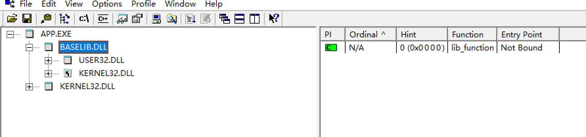
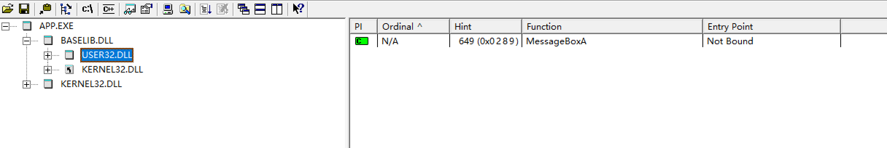
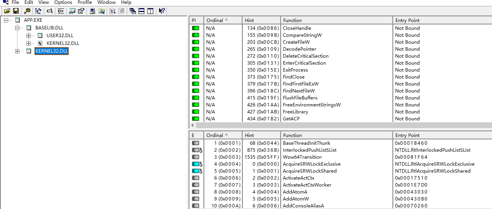

# Dll

## 一. 综合使用源代码遍历，结合三个工具dumpbin, process explore, depends都有查看可执行程序依赖的dll有什么的功能，对结果进行分析和比较

1. dumpbin

    ~~~shell
    #使用dumpbin查看app.exe的依赖的所有dll
    dumpbin /imports app.exe
    #结果
    Section contains the following imports:
    
        baseLib.dll
                    40D108 Import Address Table
                    412338 Import Name Table
                         0 time date stamp
                         0 Index of first forwarder reference
    
                        0 lib_function
    
        KERNEL32.dll
                    40D000 Import Address Table
                    412230 Import Name Table
                         0 time date stamp
                         0 Index of first forwarder reference
    
                      611 WriteConsoleW
                      44D QueryPerformanceCounter
                      218 GetCurrentProcessId
                      21C GetCurrentThreadId
                      2E9 GetSystemTimeAsFileTime
                      363 InitializeSListHead
                      37F IsDebuggerPresent
                      5AD UnhandledExceptionFilter
                      56D SetUnhandledExceptionFilter
                      2D0 GetStartupInfoW
                      386 IsProcessorFeaturePresent
                      278 GetModuleHandleW
                      217 GetCurrentProcess
                      58C TerminateProcess
                       86 CloseHandle
                      4D3 RtlUnwind
                      261 GetLastError
                      532 SetLastError
                      131 EnterCriticalSection
                      3BD LeaveCriticalSection
                      110 DeleteCriticalSection
                      35F InitializeCriticalSectionAndSpinCount
                      59E TlsAlloc
                      5A0 TlsGetValue
                      5A1 TlsSetValue
                      59F TlsFree
                      1AB FreeLibrary
                      2AE GetProcAddress
                      3C3 LoadLibraryExW
                      462 RaiseException
                      2D2 GetStdHandle
                      612 WriteFile
                      274 GetModuleFileNameW
                      15E ExitProcess
                      277 GetModuleHandleExW
                      1D6 GetCommandLineA
                      1D7 GetCommandLineW
                      109 DecodePointer
                      345 HeapAlloc
                      349 HeapFree
                      175 FindClose
                      17B FindFirstFileExW
                      18C FindNextFileW
                      38B IsValidCodePage
                      1B2 GetACP
                      297 GetOEMCP
                      1C1 GetCPInfo
                      3EF MultiByteToWideChar
                      5FE WideCharToMultiByte
                      237 GetEnvironmentStringsW
                      1AA FreeEnvironmentStringsW
                      514 SetEnvironmentVariableW
                      54A SetStdHandle
                      24E GetFileType
                      2D7 GetStringTypeW
                       9B CompareStringW
                      3B1 LCMapStringW
                      2B4 GetProcessHeap
                      34E HeapSize
                      34C HeapReAlloc
                      19F FlushFileBuffers
                      1EA GetConsoleCP
                      1FC GetConsoleMode
                      523 SetFilePointerEx
                       CB CreateFileW
    
      Summary
    
            2000 .data
            6000 .rdata
            1000 .reloc
            C000 .text
    ~~~

2. process explore(X86)

    用法：点击View，勾选Show Lower Pane，在Lower Pane View中勾选DLL，然后点击需要查看DLL的进程，下面的窗口中就会出现所有与该进程相关的DLL

    查看app.exe的DLL结果

    

3. depends22(X86)

    用法：File->open，选择app.exe

    结果：

    

    

    

### 比较与分析

使用dumpbin工具查看可执行程序的dll，可以看到app.exe直接依赖的dll及dll对应的函数（应该是被调用的函数）；使用process explore可以看到所有依赖的dll（包括app.exe直接或间接依赖的dll），但是跟depends比起来比较杂乱，层级调用关系不明确；使用depends查看app.exe的依赖dll，不仅可以看到所有的dll，还呈现出了明确的层级调用关系，和dumpbin一样，它也可以呈现出所有dll中被调用的函数于右上方，该dll的所有函数则在右下方显示；通过三种工具的对比，如果要排个使用优先级名次的话：depends>dumpbin>process explore；而dumpbin的优势在于直接在工程的命令行中就可以使用（方便），并且可以显示所有可执行程序直接依赖的dll的被调用函数。

## 二. 三个任务

### 1. 会编写dll。把.c文件编译obj文件，把obj文件和lib文件链接为新的dll和lib文件。注意使用def文件定义导出函数。

### 2. 编写一个exe,调用第一步生成的dll文件中的导出函数。方法是（1）Link是，将第一步生成的lib文件作为输入文件。（2）保证dll文件和exe文件在同一目录，或者dll 文件在系统目录

### 3. 第二步调用方式称为load time 特点是exe文件导入表中会出先需要调用的dll文件及函数名，并且link生成exe时，需明确输入lib文件。还有一种调用方式称为run time，参考链接，使用run time的方式，调用dll的导出函数。包括系统API和第一步自行生成的dll，都要能成功调用。

提示：

link /dll /def:xxx.def

link xxx.lib /out:app.exe

dumpbin /imports xxx.exe

dumpbin /exports xxx.dll