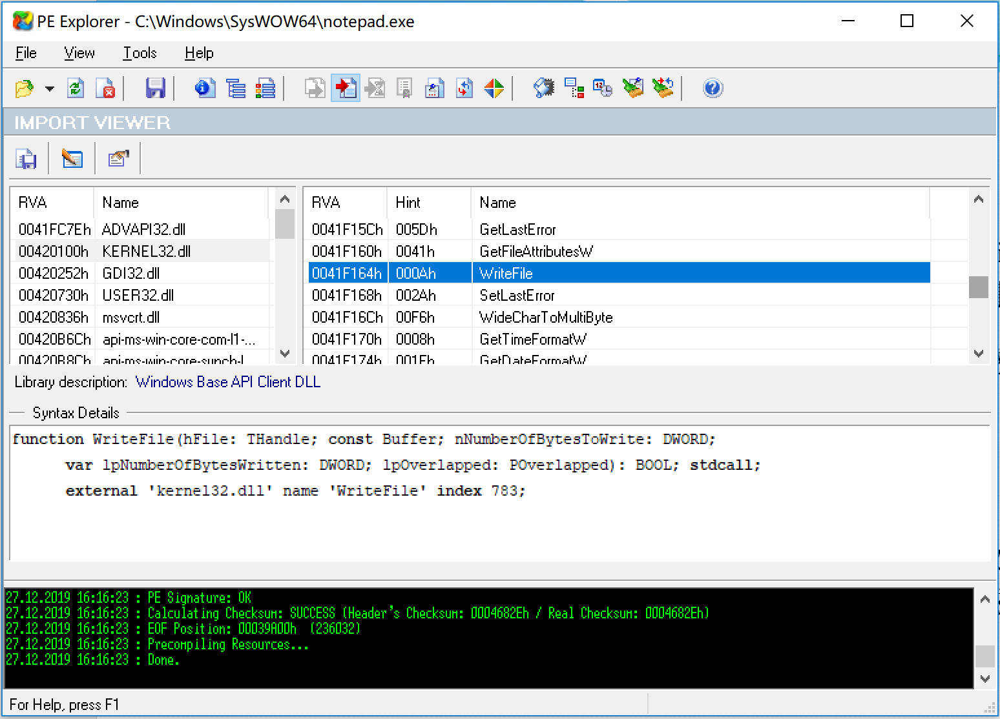
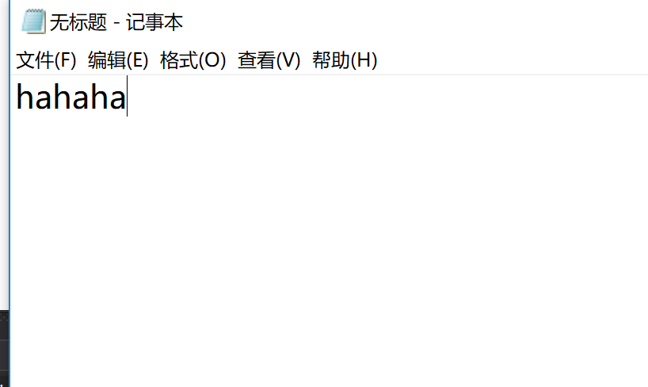
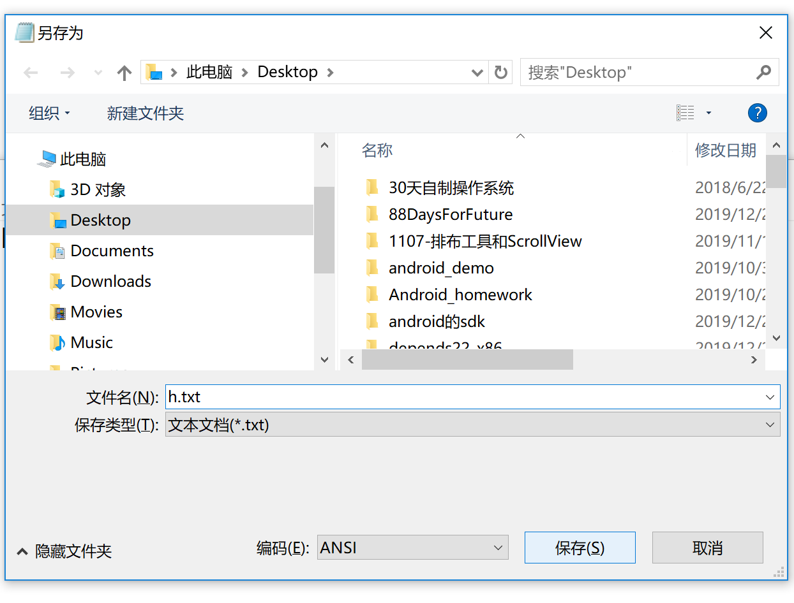
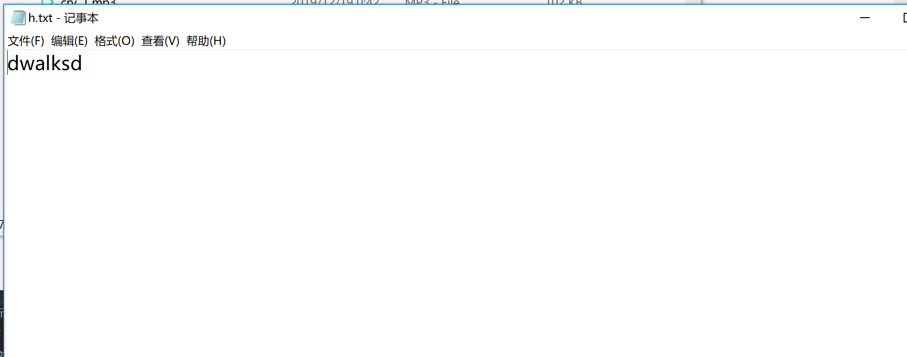

# 线程注入与IATHook综合运用，实现对系统中进程的修改

## hook WriteFile（先有CreateFile），将hahaha改为hehehe，把IATHook注入到notepad.exe，实验一下是否能成功

### 在PE Explore中打开32位的notepad.exe，查看WriteFile的dll

### 新建项目iatHookLib

在该工程下添加源文件exp.def，IATHook.c，WriteFile.c

#### IATHook.c

~~~c
// windows IATHook for kernelmode and usermode 
// by TinySec( root@tinysec.net )
// you can free use this code , but if you had modify , send a copy to to my email please.

#include<Windows.h>

LONG IATHook
(
	__in void* pImageBase,
	__in_opt char* pszImportDllName,
	__in char* pszRoutineName,
	__in void* pFakeRoutine,
	__out HANDLE* Param_phHook
);

LONG UnIATHook(__in HANDLE hHook);

void* GetIATHookOrign(__in HANDLE hHook);

//////////////////////////////////////////////////////////////////////////

#ifdef _RING0
#include <ntddk.h>
#include <ntimage.h>
#else
#include <windows.h>
#include <stdlib.h>
#endif //#ifdef _RING0

//////////////////////////////////////////////////////////////////////////

typedef struct _IATHOOK_BLOCK
{
	void*	pOrigin;

	void*	pImageBase;
	char*	pszImportDllName;
	char*	pszRoutineName;

	void*	pFake;

}IATHOOK_BLOCK;

//////////////////////////////////////////////////////////////////////////

void* _IATHook_Alloc(__in ULONG nNeedSize)
{
	void* pMemory = NULL;

	do
	{
		if (0 == nNeedSize)
		{
			break;
		}

#ifdef _RING0
		pMemory = ExAllocatePoolWithTag(NonPagedPool, nNeedSize, 'iath');

#else
		pMemory = malloc(nNeedSize);
#endif // #ifdef _RING0

		if (NULL == pMemory)
		{
			break;
		}

		RtlZeroMemory(pMemory, nNeedSize);

	} while (FALSE);

	return pMemory;
}

ULONG _IATHook_Free(__in void* pMemory)
{

	do
	{
		if (NULL == pMemory)
		{
			break;
		}

#ifdef _RING0
		ExFreePool(pMemory);

#else
		free(pMemory);
#endif // #ifdef _RING0

		pMemory = NULL;

	} while (FALSE);

	return 0;
}

//////////////////////////////////////////////////////////////////////////
#ifdef _RING0

#ifndef LOWORD
#define LOWORD(l)           ((USHORT)((ULONG_PTR)(l) & 0xffff))
#endif // #ifndef LOWORD

void*  _IATHook_InterlockedExchangePointer(__in void* pAddress, __in void* pValue)
{
	void*	pWriteableAddr = NULL;
	PMDL	pNewMDL = NULL;
	void*	pOld = NULL;

	do
	{
		if ((NULL == pAddress))
		{
			break;
		}

		if (!NT_SUCCESS(MmIsAddressValid(pAddress)))
		{
			break;
		}

		pNewMDL = IoAllocateMdl(pAddress, sizeof(void*), FALSE, FALSE, NULL);
		if (pNewMDL == NULL)
		{
			break;
		}

		__try
		{
			MmProbeAndLockPages(pNewMDL, KernelMode, IoWriteAccess);

			pNewMDL->MdlFlags |= MDL_MAPPING_CAN_FAIL;

			pWriteableAddr = MmMapLockedPagesSpecifyCache(
				pNewMDL,
				KernelMode,
				MmNonCached,
				NULL,
				FALSE,
				HighPagePriority
			);

			//pWriteableAddr = MmMapLockedPages(pNewMDL, KernelMode);
		}
		__except (EXCEPTION_EXECUTE_HANDLER)
		{
			break;
		}

		if (pWriteableAddr == NULL)
		{
			MmUnlockPages(pNewMDL);
			IoFreeMdl(pNewMDL);

			break;
		}

		pOld = InterlockedExchangePointer(pWriteableAddr, pValue);

		MmUnmapLockedPages(pWriteableAddr, pNewMDL);
		MmUnlockPages(pNewMDL);
		IoFreeMdl(pNewMDL);

	} while (FALSE);

	return pOld;
}

//////////////////////////////////////////////////////////////////////////
#else

void*  _IATHook_InterlockedExchangePointer(__in void* pAddress, __in void* pValue)
{
	void*	pWriteableAddr = NULL;
	void*	nOldValue = NULL;
	ULONG	nOldProtect = 0;
	BOOL	bFlag = FALSE;

	do
	{
		if ((NULL == pAddress))
		{
			break;
		}

		bFlag = VirtualProtect(pAddress, sizeof(void*), PAGE_EXECUTE_READWRITE, &nOldProtect);
		if (!bFlag)
		{
			break;
		}
		pWriteableAddr = pAddress;

		nOldValue = InterlockedExchangePointer(pWriteableAddr, pValue);

		VirtualProtect(pAddress, sizeof(void*), nOldProtect, &nOldProtect);

	} while (FALSE);

	return nOldValue;
}

#endif // #ifdef _RING0

LONG _IATHook_Single
(
	__in IATHOOK_BLOCK*	pHookBlock,
	__in IMAGE_IMPORT_DESCRIPTOR*	pImportDescriptor,
	__in BOOLEAN bHook
)
{
	LONG				nFinalRet = -1;

	IMAGE_THUNK_DATA*	pOriginThunk = NULL;
	IMAGE_THUNK_DATA*	pRealThunk = NULL;

	IMAGE_IMPORT_BY_NAME*	pImportByName = NULL;

	do
	{
		pOriginThunk = (IMAGE_THUNK_DATA*)((UCHAR*)pHookBlock->pImageBase + pImportDescriptor->OriginalFirstThunk);
		pRealThunk = (IMAGE_THUNK_DATA*)((UCHAR*)pHookBlock->pImageBase + pImportDescriptor->FirstThunk);

		for (; 0 != pOriginThunk->u1.Function; pOriginThunk++, pRealThunk++)
		{
			if (IMAGE_ORDINAL_FLAG == (pOriginThunk->u1.Ordinal & IMAGE_ORDINAL_FLAG))
			{
				if ((USHORT)pHookBlock->pszRoutineName == LOWORD(pOriginThunk->u1.Ordinal))
				{
					if (bHook)
					{
						pHookBlock->pOrigin = (void*)pRealThunk->u1.Function;
						_IATHook_InterlockedExchangePointer((void**)&pRealThunk->u1.Function, pHookBlock->pFake);
					}
					else
					{
						_IATHook_InterlockedExchangePointer((void**)&pRealThunk->u1.Function, pHookBlock->pOrigin);
					}

					nFinalRet = 0;
					break;
				}
			}
			else
			{
				pImportByName = (IMAGE_IMPORT_BY_NAME*)((char*)pHookBlock->pImageBase + pOriginThunk->u1.AddressOfData);

				if (0 == _stricmp(pImportByName->Name, pHookBlock->pszRoutineName))
				{
					if (bHook)
					{
						pHookBlock->pOrigin = (void*)pRealThunk->u1.Function;
						_IATHook_InterlockedExchangePointer((void**)&pRealThunk->u1.Function, pHookBlock->pFake);
					}
					else
					{
						_IATHook_InterlockedExchangePointer((void**)&pRealThunk->u1.Function, pHookBlock->pOrigin);
					}

					nFinalRet = 0;

					break;
				}
			}

		}

	} while (FALSE);

	return nFinalRet;
}

LONG _IATHook_Internal(__in IATHOOK_BLOCK* pHookBlock, __in BOOLEAN bHook)
{
	LONG				nFinalRet = -1;
	LONG				nRet = -1;
	IMAGE_DOS_HEADER*	pDosHeader = NULL;
	IMAGE_NT_HEADERS*	pNTHeaders = NULL;

	IMAGE_IMPORT_DESCRIPTOR*	pImportDescriptor = NULL;
	char*						pszImportDllName = NULL;

	do
	{
		if (NULL == pHookBlock)
		{
			break;
		}

		pDosHeader = (IMAGE_DOS_HEADER*)pHookBlock->pImageBase;
		if (IMAGE_DOS_SIGNATURE != pDosHeader->e_magic)
		{
			break;
		}

		pNTHeaders = (IMAGE_NT_HEADERS*)((UCHAR*)pHookBlock->pImageBase + pDosHeader->e_lfanew);
		if (IMAGE_NT_SIGNATURE != pNTHeaders->Signature)
		{
			break;
		}

		if (0 == pNTHeaders->OptionalHeader.DataDirectory[IMAGE_DIRECTORY_ENTRY_IMPORT].VirtualAddress)
		{
			break;
		}

		if (0 == pNTHeaders->OptionalHeader.DataDirectory[IMAGE_DIRECTORY_ENTRY_IMPORT].Size)
		{
			break;
		}

		pImportDescriptor = (IMAGE_IMPORT_DESCRIPTOR*)((UCHAR*)pHookBlock->pImageBase + pNTHeaders->OptionalHeader.DataDirectory[IMAGE_DIRECTORY_ENTRY_IMPORT].VirtualAddress);

		// Find pszRoutineName in every Import descriptor
		nFinalRet = -1;

		for (; (pImportDescriptor->Name != 0); pImportDescriptor++)
		{
			pszImportDllName = (char*)pHookBlock->pImageBase + pImportDescriptor->Name;

			if (NULL != pHookBlock->pszImportDllName)
			{
				if (0 != _stricmp(pszImportDllName, pHookBlock->pszImportDllName))
				{
					continue;
				}
			}

			nRet = _IATHook_Single(
				pHookBlock,
				pImportDescriptor,
				bHook
			);

			if (0 == nRet)
			{
				nFinalRet = 0;
				break;
			}
		}

	} while (FALSE);

	return nFinalRet;
}

LONG IATHook
(
	__in void* pImageBase,
	__in_opt char* pszImportDllName,
	__in char* pszRoutineName,
	__in void* pFakeRoutine,
	__out HANDLE* Param_phHook
)
{
	LONG				nFinalRet = -1;
	IATHOOK_BLOCK*		pHookBlock = NULL;

	do
	{
		if ((NULL == pImageBase) || (NULL == pszRoutineName) || (NULL == pFakeRoutine))
		{
			break;
		}

		pHookBlock = (IATHOOK_BLOCK*)_IATHook_Alloc(sizeof(IATHOOK_BLOCK));
		if (NULL == pHookBlock)
		{
			break;
		}
		RtlZeroMemory(pHookBlock, sizeof(IATHOOK_BLOCK));

		pHookBlock->pImageBase = pImageBase;
		pHookBlock->pszImportDllName = pszImportDllName;
		pHookBlock->pszRoutineName = pszRoutineName;
		pHookBlock->pFake = pFakeRoutine;

		__try
		{
			nFinalRet = _IATHook_Internal(pHookBlock, TRUE);
		}
		__except (EXCEPTION_EXECUTE_HANDLER)
		{
			nFinalRet = -1;
		}

	} while (FALSE);

	if (0 != nFinalRet)
	{
		if (NULL != pHookBlock)
		{
			_IATHook_Free(pHookBlock);
			pHookBlock = NULL;
		}
	}

	if (NULL != Param_phHook)
	{
		*Param_phHook = pHookBlock;
	}

	return nFinalRet;
}

LONG UnIATHook(__in HANDLE hHook)
{
	IATHOOK_BLOCK*		pHookBlock = (IATHOOK_BLOCK*)hHook;
	LONG				nFinalRet = -1;

	do
	{
		if (NULL == pHookBlock)
		{
			break;
		}

		__try
		{
			nFinalRet = _IATHook_Internal(pHookBlock, FALSE);
		}
		__except (EXCEPTION_EXECUTE_HANDLER)
		{
			nFinalRet = -1;
		}

	} while (FALSE);

	if (NULL != pHookBlock)
	{
		_IATHook_Free(pHookBlock);
		pHookBlock = NULL;
	}

	return nFinalRet;
}

void* GetIATHookOrign(__in HANDLE hHook)
{
	IATHOOK_BLOCK*		pHookBlock = (IATHOOK_BLOCK*)hHook;
	void*				pOrigin = NULL;

	do
	{
		if (NULL == pHookBlock)
		{
			break;
		}

		pOrigin = pHookBlock->pOrigin;

	} while (FALSE);

	return pOrigin;
}
~~~

#### WriteFile.c

~~~c
#include <windows.h>

LONG IATHook(
	__in_opt void* pImageBase,
	__in_opt char* pszImportDllName,
	__in char* pszRoutineName,
	__in void* pFakeRoutine,
	__out HANDLE* phHook
);

LONG UnIATHook(__in HANDLE hHook);

void* GetIATHookOrign(__in HANDLE hHook);

/*
BOOL WriteFile(
	HANDLE         hFile,
	LPCVOID        lpBuffer,
	DWORD          nNumberOfBytesToWrite,
	LPDWORD        lpNumberOfBytesWritten,
	LPOVERLAPPED   lpOverlapped
};
*/
typedef BOOL(__stdcall *LPFN_WriteFile)(__in_opt HANDLE hFile, __in_opt LPCVOID lpBuffer, __in_opt DWORD nNumberOfBytesToWrite, __in_opt LPDWORD lpNumberOfBytesWritten, __in_opt LPOVERLAPPED lpOverlapped);
HANDLE g_hHook_WriteFile = NULL;

BOOL __stdcall Fake_WriteFile(__in_opt HANDLE hFile, __in_opt LPCVOID lpBuffer, __in_opt DWORD nNumberOfBytesToWrite, __in_opt LPDWORD lpNumberOfBytesWritten, __in_opt LPOVERLAPPED lpOverlapped) {
	LPFN_WriteFile fnOrigin = (LPFN_WriteFile)GetIATHookOrign(g_hHook_WriteFile);
	if (strcmp(lpBuffer, "hahaha")==0) {
		lpBuffer = "hehehe";
	}
	return fnOrigin(hFile, lpBuffer, nNumberOfBytesToWrite, lpNumberOfBytesWritten, lpOverlapped);
}

BOOL WINAPI DllMain(
	HINSTANCE hinstDLL,  // handle to DLL module
	DWORD fdwReason,     // reason for calling function
	LPVOID lpReserved)  // reserved
{
	// Perform actions based on the reason for calling.
	switch (fdwReason)
	{
	case DLL_PROCESS_ATTACH:
		// Initialize once for each new process.
		// Return FALSE to fail DLL load.
		
		IATHook(
			GetModuleHandleW(NULL),
			"kernel32.dll",
			"WriteFile",
			Fake_WriteFile,
			&g_hHook_WriteFile
		);
		//UnIATHook(g_hHook_WriteFile);
		break;

	case DLL_THREAD_ATTACH:
		// Do thread-specific initialization.
		break;

	case DLL_THREAD_DETACH:
		// Do thread-specific cleanup.
		break;

	case DLL_PROCESS_DETACH:
		// Perform any necessary cleanup.
		break;
	}
	return TRUE;  // Successful DLL_PROCESS_ATTACH.
}
~~~

#### exp.def

~~~def
LIBRARY   iatHookLib
EXPORTS
    lib_function IATHook
	UnIATHook
	GetIATHookOrign
	Fake_WriteFile
~~~

#### 配置

右键项目->属性->在配置->常规的项目默认值中将项目类型改为**动态库(.dll)**->确定

重新生成

### 项目dllInjection

#### t_CreateRemoteThread.c

~~~c
#pragma warning(disable:4996)
#include <stdio.h>
#include <Windows.h>
#include <tlhelp32.h>
#include "fheaders.h"

DWORD findPidByName(char * pname)
{
	HANDLE h;
	PROCESSENTRY32 procSnapshot;
	h = CreateToolhelp32Snapshot(TH32CS_SNAPPROCESS, 0);
	procSnapshot.dwSize = sizeof(PROCESSENTRY32);

	if (!Process32First(h, &procSnapshot)) {
		puts("Process32First Error"); // show cause of failure
		CloseHandle(h);				  // clean the snapshot object
		return(FALSE);
	}

	do
	{
		char s[1000];
		strcpy(s, (char*)procSnapshot.szExeFile);
		//printf("%s id:%d return:%d\n", s, procSnapshot.th32ProcessID, strcmp(s, pname));
		if (!strcmp(s, pname))
		{
			DWORD pid = procSnapshot.th32ProcessID;
			CloseHandle(h);
#ifdef _DEBUG
			printf("[+] PID found: %ld\n", pid);
#endif
			return pid;
		}
	} while (Process32Next(h, &procSnapshot));

	CloseHandle(h);
	return 0;
}

DWORD demoCreateRemoteThreadW(PCWSTR pszLibFile, DWORD dwProcessId)
{
	// Calculate the number of bytes needed for the DLL's pathname
	DWORD dwSize = (lstrlenW(pszLibFile) + 1) * sizeof(wchar_t);

	// Get process handle passing in the process ID
	HANDLE hProcess = OpenProcess(
		PROCESS_QUERY_INFORMATION |
		PROCESS_CREATE_THREAD |
		PROCESS_VM_OPERATION |
		PROCESS_VM_WRITE,
		FALSE, dwProcessId);
	if (hProcess == NULL)
	{
		printf(TEXT("[-] Error: Could not open process for PID (%d).\n"), dwProcessId);
		return(1);
	}

	// Allocate space in the remote process for the pathname
	LPVOID pszLibFileRemote = (PWSTR)VirtualAllocEx(hProcess, NULL, dwSize, MEM_COMMIT, PAGE_READWRITE);
	if (pszLibFileRemote == NULL)
	{
		printf(TEXT("[-] Error: Could not allocate memory inside PID (%d).\n"), dwProcessId);
		return(1);
	}

	// Copy the DLL's pathname to the remote process address space
	DWORD n = WriteProcessMemory(hProcess, pszLibFileRemote, (PVOID)pszLibFile, dwSize, NULL);
	if (n == 0)
	{
		printf(TEXT("[-] Error: Could not write any bytes into the PID [%d] address space.\n"), dwProcessId);
		return(1);
	}

	// Get the real address of LoadLibraryW in Kernel32.dll
	PTHREAD_START_ROUTINE pfnThreadRtn = (PTHREAD_START_ROUTINE)GetProcAddress(GetModuleHandle(TEXT("Kernel32")), "LoadLibraryW");
	if (pfnThreadRtn == NULL)
	{
		printf(TEXT("[-] Error: Could not find LoadLibraryW function inside kernel32.dll library.\n"));
		return(1);
	}

	// Create a remote thread that calls LoadLibraryW(DLLPathname)
	HANDLE hThread = CreateRemoteThread(hProcess, NULL, 0, pfnThreadRtn, pszLibFileRemote, 0, NULL);
	if (hThread == NULL)
	{
		printf(TEXT("[-] Error: Could not create the Remote Thread.\n"));
		return(1);
	}
	else
		printf(TEXT("[+] Success: DLL injected via CreateRemoteThread().\n"));

	// Wait for the remote thread to terminate
	WaitForSingleObject(hThread, INFINITE);

	// Free the remote memory that contained the DLL's pathname and close Handles
	if (pszLibFileRemote != NULL)
		VirtualFreeEx(hProcess, pszLibFileRemote, 0, MEM_RELEASE);

	if (hThread != NULL)
		CloseHandle(hThread);

	if (hProcess != NULL)
		CloseHandle(hProcess);

	return(0);
}

int main() {
	DWORD pid = findPidByName("notepad.exe");
	if (pid != 0) {
		demoCreateRemoteThreadW(L"C:\\Users\\guoyi\\source\\repos\\CreateThread\\Debug\\iatHookLib.dll", pid);
	}
	getchar();
	return 0;
}
~~~

重新生成

打开32位的notepad.exe

打开Debug目录，用管理员权限运行dllInjection.exe，

测试结果如下：

向notepad.exe中写入hahaha

保存为h.txt

打开h.txt

再测试一下不是hahaha的情况，

没有变成hehehe

结课感受：**一切都在内存中，在内存中就可以被修改**

